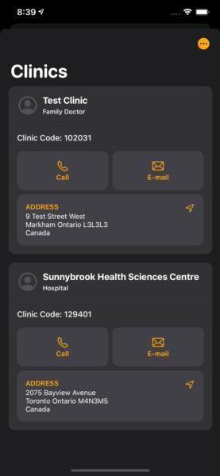

# mango CARE
**mango CARE** is a Personal Health Record app that enables patients to keep a well-organized record of their prescriptions, blood glucose values, blood pressure values, weight measurements, and clinic appointments, and set alerts to remind them to take their prescriptions, measure their health indices, and attend their appointments. Mango Care stores all sensitive data using Core Data persistent containers to keep the user's data secure.

Upcoming versions of mango CARE will focus on interactions between the users and their designated clinics or other healthcare facilities. For example, patients will be able to share their data with their medical professionals in order to receive appropriate coaching and prescription adjusting to better suit their current health trend. Moreover, medical professionals will be able to push prescription information to their designated patients, set appointments, or send lab results directly to the users. 

mango CARE allows for unimpeded access to a patient’s own medical record and will play a bigger role in the growing telemedicine industry.

#### Technology: Core Data, CloudKit, UNNotification, Diffable Data Source, REST API, Sign-in with Apple, HealthKit, CareKit
#### 3rd Party Libraries: FSCalendar, Charts
## Screen Recordings

### Charts to Visualize Health Index Values
 

### URLSession API Call to [Canadian Drug Product Database](https://health-products.canada.ca/api/documentation/dpd-documentation-en.html)

### PHPicker to Upload Images

### UIDocumentPicker

### Custom Views, UNUserNotificationCenter, FSCalendar to Add Appointment Information

### NSDiffableDataSourceSnapshot to Add or Remove CollectionView Items

### Custom Views and Animation to Present Modal ViewController 

### Custom CollectionView Cell with Button that updates Core Data Object Values

### Using CareKit and OCKContacts to add Clinic info with MapKit

### Prioritizing Security for Users Using Biometric Lock and Privacy Window

